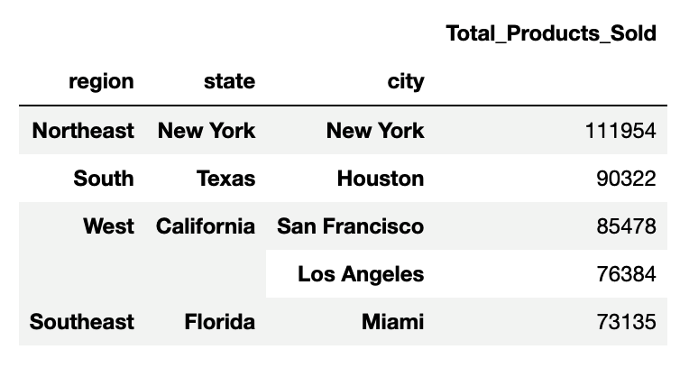
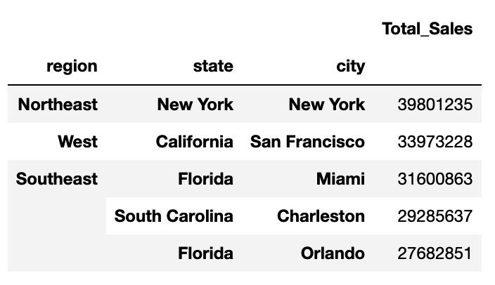
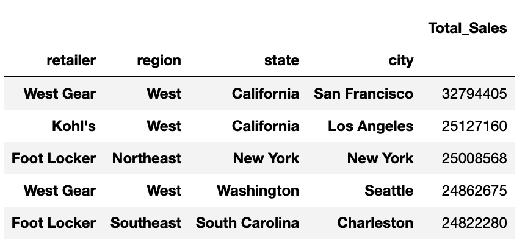
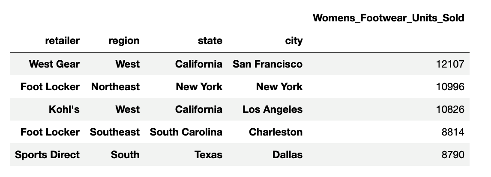
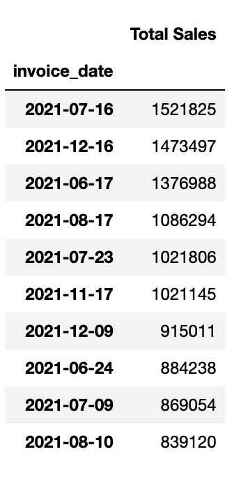
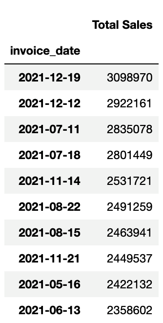

# athletic_sales_analysis
## Combine and Clean the Data
1. Import the two CSV files, ```athletic_sales_2020.csv``` and ```athletic_sales_2021.csv```, and read them into DataFrames.

2. Check that the columns in the two DataFrames have similar names and data types.

3. Combine the two DataFrames by the rows using an inner join, and reset the index.

    - **HINT**: Read over the instructions to determine if you should use ```concat```, ```join```, or ```merge```.

4. After combining the DataFrames, do the following:

    - Check if there are any null values.
    - Check each column’s data type.
    - Convert the "invoice_date" column to a datetime data type.
    - Confirm that the data type has been changed.

## Determine which Region Sold the Most Products
1. Use either the ```groupby``` or ```pivot_table``` function to create a multi-index DataFrame with the "region", "state", and "city" columns.
2. Rename the aggregated column to reflect the aggregation of the data in the column.
3. Sort the results in descending order to show the top five regions, including the state and city that have the greatest number of products sold. Your final table should look like the following image:
<div style="text-align:center;">

</div>
    
    The top five regions with their states and cities that have the greatest number of products sold.

## Determine which Region had the Most Sales
1. Use either the ```groupby``` or ```pivot_table``` function to create a multi-index DataFrame with the "region", "state", and "city" columns.

2. Rename the aggregated column to reflect the aggregation of the data in the column.

3. Sort the results in descending order to show the top five regions, including the state and city that generated the most sales. Your final table should look like the following image:
<div style="text-align:center;">

</div>

    The top five regions with their states and cities that generated the most sales.


## Determine which Retailer had the Most Sales
1. Use either the ```groupby``` or ```pivot_table``` function to create a multi-index DataFrame with the "retailer", "region", "state", and "city" columns.

2. Rename the aggregated column to reflect the aggregation of the data in the column.

3. Sort the results in descending order to show the top five retailers along with their region, state, and city that generated the most sales. Your final table should look like the following image:
<div style="text-align:center;">

</div>
    
    The top five retailers along with their region, state, and city that have the greatest average price for the products ordered.

## Determine which Retailer Sold the Most Women's Athletic Footwear
1. Filter the combined DataFrame to create a DataFrame with only women's athletic footwear sales data.
    - **HINT** Use ```df[df["column_name"].str.contains("<value>")]``` or ```df.loc[(df["column_name"] =="<value>")]```.
    <div style="text-align:center;">
    
    </div>

    we used the ```df.query``` method to filter the data
2. Use either the ```groupby``` or ```pivot_table``` function to create a multi-index DataFrame with the "retailer", "region", "state", and "city" columns.
3. Rename the aggregated column to reflect the aggregation of the data in the column.

4. Sort the results in descending order to show the top five retailers along with their region, state, and city that sold the most women's athletic footwear. Your final table should look like the following image:
<div style="text-align:center;">

</div>

    The top five retailers along with their region, state, and city that sold the most women's athletic footwear.

## Determine the Day with the Most Women's Athletic Footwear Sales
1. Create a pivot table with the "invoice_date" column as the index and the "total_sales" column as the ```values``` parameter.

2. Rename the aggregated column to reflect the aggregation of the data in the column.

3. Apply the ```resample``` function to the pivot table, place the data into daily bins, and get the total sales for each day.

4. Sort the resampled DataFrame in descending order to show the top 10 days that generated the most women's athletic footwear sales. Your final table should look like the following image:

<div style="text-align:center;">

</div>

    The top 10 days that generated the most women's athletic footwear sales.

## Determine the Week with the Most Women's Athletic Footwear Sales
1. Apply ```resample``` to the pivot table above, place the data into weekly bins, and get the total sales for each week.

2. Sort the resampled DataFrame in descending order to show the top 10 weeks that generated the most women's athletic footwear sales. Your final table should look like the following image:

<div style="text-align:center;">

</div>

    The top 10 weeks that generated the most women's athletic footwear sales.